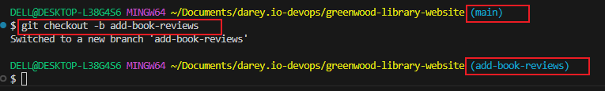
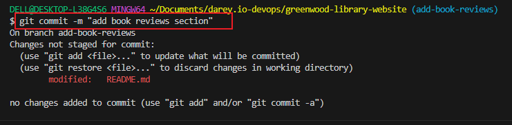
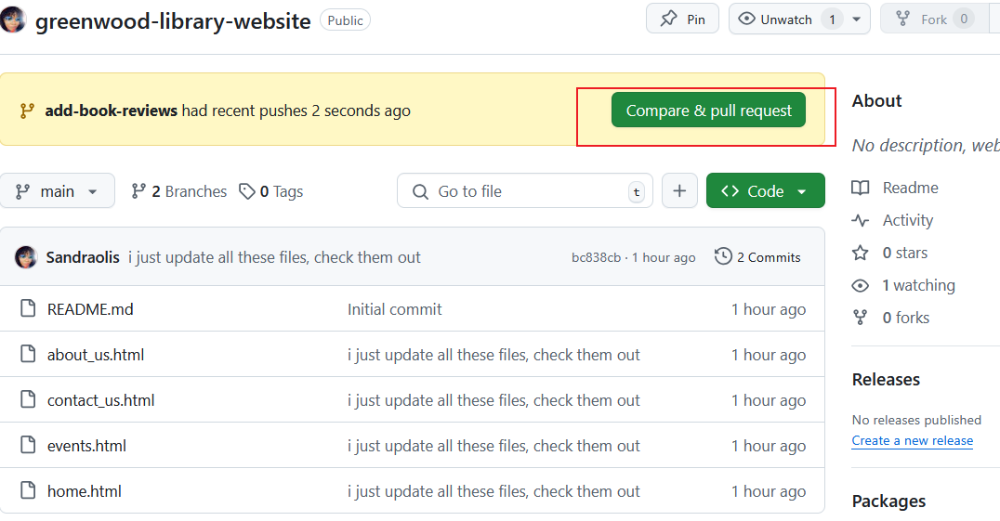

# greenwood-library-website
## Mongan's Work: Adding Book Reviews.
1. ### Create and switch to New branch.
``` bash
git checkout main
git pull origin main
git branch add-book-reviews
```


2. ## Stage and Commit Changes:

``` bash
git add book_reviews.html
git commit -m "Add book reviews section"
git push origin add-book-reviews
```


`The push origin add-book-reviews`


3. ## Creating Pull Request for Morgan's Work
### Steps:

1. Navigate to the cloned Github repository
2. Click "Compare & pull request" for add-book-reviews




below the pull request page, you wouls see create pull request. click on it


4. Merging to Main
``` bash
git checkout main
git merge add-book-reviews
git push origin main
```


# Jamies work: Updating Events Page
1. ## Create and Switch to New Branch:

``` bash
git checkout main
git pull origin main
git checkout -b update-events
```


2. ## Staging and Commiting Change:
``` bash
git add .
git commit -m "this is the homepage"
git push origin update-events
 ```
 

 3. ## Creating Pull Request for Morgan's Work:
 Confirm compare and pull request

 

 click on the pull request

 

 Confirm that there is no conflict

 

 switch to main branch and pull

 
